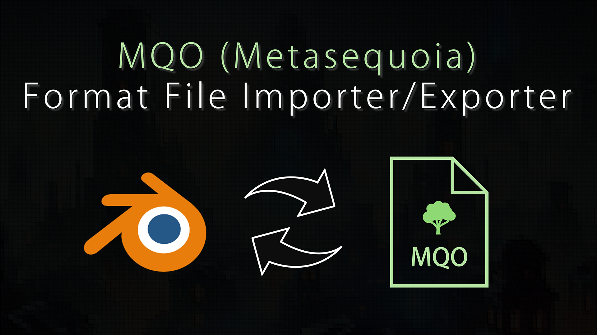

# Blender Add-on: blender-mqo (Metasequoia File Importer/Exporter)

blender-mqo is an importer/exporter between Blender and Metasequoia via .mqo files.

*To realize the long support of this add-on, your support is helpful.*
*You can support the development of this add-on via*
**[GitHub Sponsors](https://github.com/sponsors/nutti)**.
*See [the contribution document](CONTRIBUTING.md) for the detail of*
*the support.*

## Download / Installation

Before installing blender-mqo add-on, check if
[the add-on version](docs/installation.md#support-version) supports on the your
Blender version.

All released blender-mqo add-on is available on
[Release Page](https://github.com/nutti/blender-mqo/releases).  
If you want to try newest (unstable) version, you can download it from
[unstable version](https://github.com/nutti/blender-mqo/archive/master.zip).

Installation process is a bit confusing.  
See [Document](docs/installation.md) if you have any trouble to install this
add-on.

## Features

blender-mqo supports **English** only.  
The features of this add-on are as follows.

* Import .mqo File
  * Object (includes Mesh)
  * UV map
  * Materials
  * Mirror modifier
  * Vertex weights
* Export .mqo File
  * Object (includes Mesh)
  * UV map
  * Materials
  * Modifiers (All modifiers are applied before exporting)
  * Vertex weights

## Tutorials

See [Document](docs/tutorial.md) to know the details of this add-on.

## Change Log

See [CHANGELOG.md](CHANGELOG.md).

## Bug report / Feature request / Discussions

If you want to report bug, request features or discuss about this add-on, see
[ISSUES.md](ISSUES.md).

If you want to have an interactive discussion, you can use
[blender-mqo channel](https://discord.gg/VSJca2PzFM) on the Discord server.

## Contribution

If you want to contribute to this project, see
[CONTRIBUTING.md](CONTRIBUTING.md).

## Project Authors

### Owner

[**@nutti**](https://github.com/nutti)

Indie Game/Application Developer.  
Especially, I spend most time to improve Blender and Unreal Game Engine via
providing the extensions.

Support via [GitHub Sponsors](https://github.com/sponsors/nutti)

* CONTACTS: [Twitter](https://twitter.com/nutti__)
* WEBSITE: [Japanese Only](https://colorful-pico.net/)

### Contributors

* [**@sapper-trle**](https://github.com/sapper-trle)
* [**@kant**](https://github.com/kant)
* [**@finict**](https://github.com/finict)
